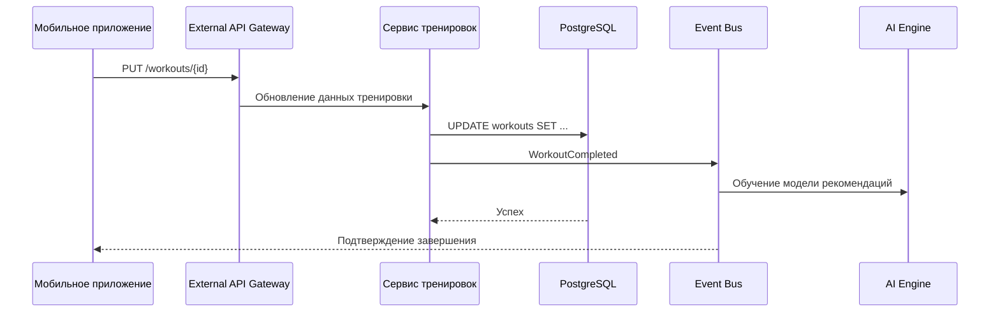

## Завершение тренировки и отправка данных с GPS

### Описание:
После окончания тренировки отправляются полные данные (маршрут, показания датчиков). Это событие триггерит машинное обучение для дальнейших рекомендаций.