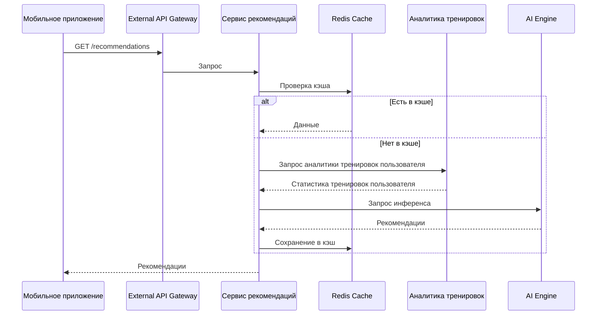

## Получение персонализированной рекомендации

```mermaid
sequenceDiagram
    participant M as Мобильное приложение
    participant A as External API Gateway
    participant R as Сервис рекомендаций
    participant C as Redis Cache
    participant TA as Аналитика тренировок
    participant AI as AI Engine

    M->>A: GET /recommendations
    A->>R: Запрос
    R->>C: Проверка кэша
    alt Есть в кэше
        C-->>R: Данные
    else Нет в кэше
        R->>TA: Запрос аналитики тренировок пользователя
        TA-->>R: Статистика тренировок пользователя
        R->>AI: Запрос инференса
        AI-->>R: Рекомендации
        R->>C: Сохранение в кэш
    end
    R-->>M: Рекомендации
```

### Описание:
Рекомендации по тренировкам могут быть получены из кэша или сгенерированы динамически через AI-движок.