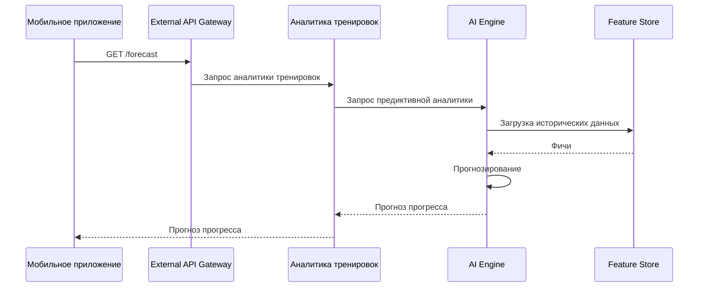

## Получение прогноза прогресса

```mermaid
sequenceDiagram
    participant M as Мобильное приложение
    participant A as External API Gateway
    participant TA as Аналитика тренировок
    participant AI as AI Engine
    participant F as Feature Store

    M->>A: GET /forecast
    A->>TA: Запрос аналитики тренировок
    TA->>AI: Запрос предиктивной аналитики
    AI->>F: Загрузка исторических данных
    F-->>AI: Фичи
    AI->>AI: Прогнозирование
    AI-->>TA: Прогноз прогресса
    TA-->>M: Прогноз прогресса
```

### Описание:
AI Engine использует данные о предыдущих тренировках для прогнозирования будущего прогресса пользователя.