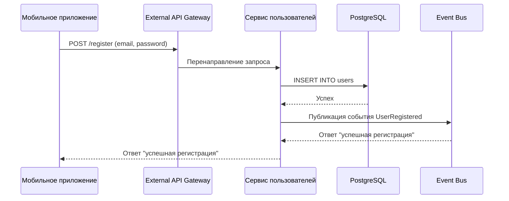

## Пользователь регистрируется через email

### Описание:

Пользователь проходит регистрацию через email и пароль. Данные сохраняются в реляционной БД. Генерируется событие `UserRegistered`, которое может запустить welcome-нотификацию или начисление бонусных баллов.
