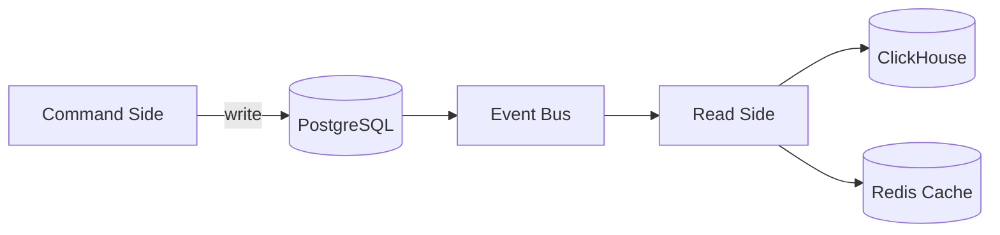
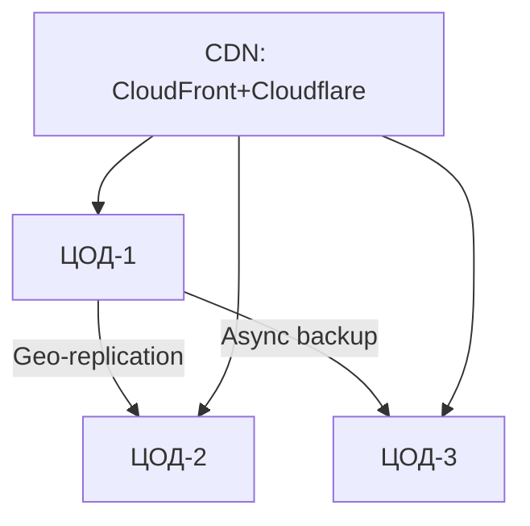
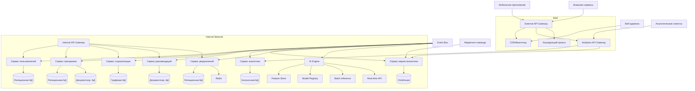
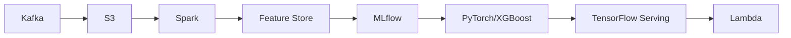

# Базовая архитектура

## Архитектурный стек

### Основные слои:

1. **Клиентский уровень:**
   - Мобильное приложение (React Native)
   - Веб-интерфейс администратора (React + Next.js)
2. **Сетевой уровень:**
   - API Gateway (внешний и внутренний)
   - CDN для статики
3. **Сервисный уровень:**
   - Микросервисы (Go, Python)
4. **Интеграционный уровень:**
   - Event Bus (Apache Kafka)
   - Message Queue (NATS JetStream)
5. **Уровень хранения данных:**
   - PostgreSQL, MongoDB, ClickHouse, Redis, S3, Delta Lake
6. **AI/ML уровень:**
   - PyTorch, XGBoost, FastAPI, Lambda, MLflow
7. **Инфраструктурный уровень:**
   - Kubernetes, Docker, Terraform, OpenTelemetry, ELK, Grafana

---

## Структура сервисов

| Сервис                      | Назначение                                  | Тип архитектуры          |
| --------------------------- | ------------------------------------------- | ------------------------ |
| Пользователи и безопасность | Управление профилями, авторизация, сессии   | Микросервис              |
| Тренировки (Core Domain)    | Запись, обработка и анализ тренировок       | Микросервис + CQRS       |
| Социализация и геймификация | Группы, чаты, достижения                    | Микросервис              |
| Рекомендации и промоакции   | Персонализированные тренировки, промокоды   | Микросервис + Serverless |
| Аналитика тренировок        | Лидерборды, сравнения, прогнозирование      | Микросервис + CQRS       |
| Маркетинговая аналитика     | Конверсии, A/B тесты, сегментация           | Микросервис              |
| Уведомления                 | Push, email, SMS, внутриприложные сообщения | Микросервис + Serverless |
| AI Engine                   | Обучение моделей, инференс, рекомендации    | Микросервис + Serverless |

---

## **Архитектурные принципы и подходы**

### Основные архитектурные принципы:

- **Микросервисная архитектура (MSA):**

  - Каждый сервис — отдельное deployable-приложение с изолированной логикой, данными и CI/CD.
  - Независимое развертывание, масштабирование и обновление сервисов без влияния на другие части системы.
  - Принцип Single Responsibility: каждый микросервис решает одну задачу.

- **Domain-Driven Design:**

  - Доменная декомпозиция: выделение bounded contexts (например, пользователи, тренировки, аналитика).
  - Чёткое разделение core domain (ключевая бизнес-логика) и supporting domains (вспомогательные).

- **Event-Driven Architecture:**

  - Асинхронное взаимодействие через Apache Kafka и NATS JetStream.
  - Использование событий как источника истины (event sourcing), особенно для критичных данных.
  - CQRS для разделения потоков чтения и записи.

- **DevOps & GitOps:**

  - Инфраструктура как код (IaC) через Terraform и Helm.
  - Автоматизированные pipeline через GitLab CI и ArgoCD.
  - Immutable infrastructure и zero-downtime deployment.

- **Обслуживаемость и наблюдаемость:**

  - Логирование, мониторинг, метрики и трассировка реализуются в каждом сервисе.
  - Использование OpenTelemetry, Prometheus, Loki, Jaeger.

- **Безопасность "по умолчанию":**
  - mTLS между внутренними сервисами.
  - Все данные шифруются (на уровне транспорта и хранения).
  - Соблюдение GDPR и регулярные пентесты.

---

## Архитектурные решения

### Микросервисная архитектура (MSA)

- Каждый сервис имеет **отдельную базу (базы) данных**, что обеспечивает:
  - Изоляцию данных
  - Гибкость в выборе технологий
  - Независимое развертывание и масштабирование

### Event-Driven Architecture

- Используется Apache Kafka как основной брокер событий
- NATS JetStream — для реального времени (например, уведомления)
- Паттерны:
  - **Event Sourcing** для критичных данных (пользователи, тренировки)
  - **CQRS** для разделения чтения и записи (тренировки, аналитика)
  - **Pub/Sub** для межсервисного взаимодействия

### CQRS

- Пример реализации:



### Multi-Region стратегия



---

## Безопасность

- **DMZ зона:**

  - External API Gateway
  - CDN + фронтенд
  - Кэширующие прокси

- **Internal Network:**

  - Internal API Gateway (mTLS)
  - Микросервисы
  - Базы данных

- **Меры:**
  - TLS 1.3
  - Шифрование PII
  - 2FA
  - SIEM
  - GDPR-комплаенс

---

## Нефункциональные требования и их реализация

| Атрибут качества           | Реализация                                                  |
| -------------------------- | ----------------------------------------------------------- |
| **Надежность**             | Горячий резерв, RTO ≤ 15 мин, автоматическое восстановление |
| **Масштабируемость**       | Kubernetes, контейнеризация, шардинг данных                 |
| **Производительность**     | Caching (Redis), CDN, оптимизация запросов, AI-ускорители   |
| **Безопасность**           | mTLS, 2FA, шифрование, SIEM, регулярные пентесты            |
| **Совместимость**          | RESTful API, SDK для мобильных устройств                    |
| **Удобство использования** | Offline-режим, голосовое управление, адаптивный UI          |
| **Поддерживаемость**       | CI/CD, централизованные логи, документация                  |

---

## Адресация атрибутов качества

| Атрибут качества       | Уровень важности | Сервисы, влияющие на него     | Механизмы обеспечения                           |
| ---------------------- | ---------------- | ----------------------------- | ----------------------------------------------- |
| **Надежность**         | Критический      | Все core-сервисы              | Репликация, резервирование, мониторинг          |
| **Безопасность**       | Критический      | Пользователи, AI, Уведомления | Шифрование, 2FA, SIEM, аудит                    |
| **Функциональность**   | Критический      | Все сервисы                   | Покрытие MVP, тестирование, CI/CD               |
| **Производительность** | Высокий          | Тренировки, Аналитика         | Caching, CDN, CQRS                              |
| **Масштабируемость**   | Высокий          | Все сервисы                   | Kubernetes, sharding, autoscaling               |
| **Результативность**   | Высокий          | Рекомендации, AI, Маркетинг   | Персонализация, A/B тесты, аналитика            |
| **Совместимость**      | Средний          | Уведомления, Социализация     | REST API, SDK, интеграции с Apple Health и т.д. |
| **Доступность**        | Базовый          | Все сервисы                   | WCAG 2.1, screen reader support                 |
| **Поддерживаемость**   | Базовый          | Все сервисы                   | Документация, CI/CD, мониторинг                 |

---

## Диаграмма архитектуры



---

## Интеграции

| Компонент          | Назначение                               | Особенности                             |
| ------------------ | ---------------------------------------- | --------------------------------------- |
| **Платежи**        | Обработка подписок, покупок              | Через внешний API в DMZ                 |
| **Фитнес-гаджеты** | Интеграция с wearable-устройствами       | Поддержка OAuth, API через DMZ          |
| **Соцсети**        | Авторизация через соцсети, share-функции | Проксирование через DMZ                 |
| **CRM**            | Передача данных о пользователях          | Через маркетинговый API                 |
| **CDN**            | Раздача статики                          | CloudFront + Cloudflare с гео-роутингом |

---

## AI/ML Stack

### Data Pipeline:



### Интеграция с Event Bus:

- События `WorkoutCompleted` → запуск модели прогнозирования прогресса
- События `UserMetricsUpdated` → пересчет рекомендаций

---

## Deployment & DevOps

| Этап                 | Инструменты                                 |
| -------------------- | ------------------------------------------- |
| CI/CD                | GitLab CI, ArgoCD                           |
| Оркестрация          | Kubernetes                                  |
| IaC                  | Terraform                                   |
| Мониторинг           | Prometheus + Grafana, OpenTelemetry, Loki   |
| Логирование          | ELK Stack (Elasticsearch, Logstash, Kibana) |
| Трассировка          | Jaeger, OpenTelemetry                       |
| Управление секретами | HashiCorp Vault                             |

---

## Соответствие бизнес-требованиям и НФТ

| Функционал                                 | Сервис                      | Атрибуты качества, покрытые этим компонентом           |
| ------------------------------------------ | --------------------------- | ------------------------------------------------------ |
| Управление пользователями                  | Пользователи и безопасность | Надежность, безопасность, функциональность             |
| Хранение и анализ тренировок               | Тренировки                  | Производительность, масштабируемость, надежность       |
| Чаты, группы, достижения                   | Социализация                | Совместимость, удобство использования                  |
| Персонализированные тренировки и промокоды | Рекомендации                | Результативность, масштабируемость                     |
| Лидерборды, прогнозы, сравнения            | Аналитика тренировок        | Производительность, точность данных                    |
| A/B тестирование, сегментация              | Маркетинговая аналитика     | Результативность, масштабируемость                     |
| Отправка push/email/SMS                    | Уведомления                 | Надежность, доступность, удобство использования        |
| Персонализация, предиктивная аналитика     | AI Engine                   | Результативность, масштабируемость, производительность |

---

## **Политики управления версиями API**

### Версионирование:

- **Типы версионирования:**

  - URI versioning: `/api/v1/workouts`
  - Header-based versioning: `Accept: application/vnd.myapp.v1+json`
  - Query param: `?version=1`

- **Поддержка обратной совместимости:**
  - Версии API не должны ломать существующих клиентов.
  - Устаревшие эндпоинты могут быть deprecated, но продолжают работать в течение определённого времени.
  - Механизмы автоматического тестирования совместимости.

### Жизненный цикл API:

| Статус     | Описание                                                 |
| ---------- | -------------------------------------------------------- |
| Active     | Текущая актуальная версия API                            |
| Deprecated | Поддерживается, но рекомендуется переход на новую версию |
| Sunsetted  | Более не обслуживается, доступ может быть ограничен      |

### Рекомендации:

- Публиковать OpenAPI/Swagger спецификации для всех сервисов.
- Вести changelog изменений API.
- Предоставлять SDK для мобильных и веб-клиентов.

---

## **Стандарты кодирования и архитектурные контракты**

Чтобы все команды соблюдали единообразие, необходимо описать стандарты разработки и общие практики.

### Общие стандарты:

- **Формат и структура проекта:**

  - Единая структура репозиториев (`cmd`, `pkg`, `internal`, `api`, `migrations`).
  - Разделение слоёв: handler → service → repository.

- **Логирование:**

  - Формат JSON с обязательными полями: `timestamp`, `level`, `service`, `caller_service`, `trace_id`, `correlation_id`, `span_id`.
  - Логи отправляются в ELK Stack и Loki.

- **Метрики и трейсы:**

  - Все сервисы предоставляют `/metrics` и `/healthcheck` endpoint'ы.
  - Использование OpenTelemetry для распределённой трассировки.

- **Обработка ошибок:**

  - Единый формат ответа об ошибках:
    ```json
    {
      "error": "validation_failed",
      "message": "Invalid email format",
      "code": 400,
      "details": { ... }
    }
    ```
  - HTTP-статусы в соответствии с REST-стандартами.

- **Документация:**

  - README в каждом сервисе.
  - Swagger/OpenAPI спецификации.
  - Архитектурные решения в виде ADR.

- **Docker и Helm:**
  - Шаблонные Dockerfile и Helm charts для всех сервисов.
  - Минимизация размера образа, использование multi-stage build.

---

## **Модель данных (Data Model)**

### Основные сущности:

#### Пользователь (`User`)

```json
{
  "id": "uuid",
  "email": "string",
  "first_name": "string",
  "last_name": "string",
  "created_at": "datetime",
  "last_login": "datetime"
}
```

#### Тренировка (`Workout`)

```json
{
  "id": "uuid",
  "user_id": "uuid",
  "start_time": "datetime",
  "end_time": "datetime",
  "duration_sec": "int",
  "calories_burned": "float",
  "sport_type": "enum",
  "coordinates": "array<latlng>",
  "device": "string"
}
```

#### Достижения (`Achievement`)

```json
{
  "id": "uuid",
  "type": "string",
  "user_id": "uuid",
  "achieved_at": "datetime",
  "progress": "float"
}
```

#### Уведомления (`Notification`)

```json
{
  "id": "uuid",
  "user_id": "uuid",
  "title": "string",
  "body": "string",
  "read": "boolean",
  "channel": "push/email/sms/in_app",
  "sent_at": "datetime"
}
```

### Связи:

- Пользователь ↔ Тренировки (1:N)
- Пользователь ↔ Достижения (1:N)
- Пользователь ↔ Уведомления (1:N)

### Хранилища:

| Сервис               | База данных          | Тип данных                          |
| -------------------- | -------------------- | ----------------------------------- |
| Пользователи         | PostgreSQL           | Реляционные данные                  |
| Тренировки           | PostgreSQL + MongoDB | Детали + координаты                 |
| Социализация         | Neo4j                | Графовые связи (чаты, группы)       |
| Аналитика тренировок | ClickHouse           | OLAP-запросы                        |
| Уведомления          | Redis + PostgreSQL   | Кэширование + долгосрочное хранение |

### Политики управления данными:

- **Жизненный цикл:**

  - Данные пользователя — бессрочное хранение.
  - Координаты тренировок — TTL 6 месяцев.
  - Логи и события — хранение 90 дней.

- **Резервное копирование:**

  - Ежедневный бэкап в S3 через WAL-G.
  - Восстановление за последние 7 дней.

- **GDPR и конфиденциальность:**
  - PII-данные шифруются перед сохранением.
  - Возможность удаления пользователя с очисткой всех его данных.

---

# Агрегаты (на примере сервиса "Тренировки")

**Агрегат:** `Workout`

### Командная сторона (Command Side):

#### Команды:

- **StartWorkout** — начать тренировку.
- **UpdateWorkout** — обновить данные тренировки (например, координаты или пульс).
- **PauseWorkout** — приостановить тренировку.
- **ResumeWorkout** — возобновить приостановленную тренировку.
- **CompleteWorkout** — завершить тренировку.
- **CancelWorkout** — отменить тренировку.

#### События:

- **WorkoutStarted** — тренировка начата.
- **WorkoutUpdated** — обновлены параметры тренировки.
- **WorkoutPaused** — тренировка приостановлена.
- **WorkoutResumed** — тренировка возобновлена.
- **WorkoutCompleted** — тренировка успешно завершена.
- **WorkoutCancelled** — тренировка отменена.

---

### Сторона запросов (Query Side):

#### Read Models:

- **WorkoutSummary** — краткая информация о тренировке: ID, пользователь, тип спорта, время начала/окончания, продолжительность, потраченные калории.
- **WorkoutDetails** — подробные данные о тренировке: координаты, пульс, высота, темп, маршруты, теги.
- **WorkoutList** — список тренировок пользователя за период.
- **WorkoutStats** — агрегированная статистика: общее время тренировок, средняя скорость, рекорды, недельная активность.
- **WorkoutRouteMap** — маршрут тренировки в виде геокоординат (для отображения на карте).

#### Запросы:

- **GetWorkoutSummary** — получить краткую информацию о конкретной тренировке.
- **GetWorkoutDetails** — получить полные данные о тренировке.
- **GetWorkoutList** — получить список всех тренировок пользователя.
- **GetWorkoutStats** — получить статистику по тренировкам пользователя.
- **GetWorkoutRouteMap** — получить маршрут тренировки для отображения на карте.

---

### Примеры данных:

#### 📌 `WorkoutStarted` (событие)

```json
{
  "event_id": "uuid",
  "type": "WorkoutStarted",
  "timestamp": "2025-04-05T15:00:00Z",
  "data": {
    "workout_id": "uuid",
    "user_id": "uuid",
    "sport_type": "running",
    "start_time": "2025-04-05T15:00:00Z",
    "location": {
      "latitude": 55.7558,
      "longitude": 37.6173
    },
    "device_model": "Apple Watch Series 9"
  }
}
```

#### 📌 `WorkoutUpdated` (событие)

```json
{
  "event_id": "uuid",
  "type": "WorkoutUpdated",
  "timestamp": "2025-04-05T15:15:00Z",
  "data": {
    "workout_id": "uuid",
    "current_distance_meters": 1200,
    "avg_heart_rate": 140,
    "current_speed": 4.5
  }
}
```

#### 📌 `WorkoutCompleted` (событие)

```json
{
  "event_id": "uuid",
  "type": "WorkoutCompleted",
  "timestamp": "2025-04-05T15:45:00Z",
  "data": {
    "workout_id": "uuid",
    "end_time": "2025-04-05T15:45:00Z",
    "duration_sec": 2700,
    "distance_meters": 5200,
    "calories_burned": 320,
    "route_coordinates": [
      { "lat": 55.7558, "lon": 37.6173 },
      { "lat": 55.7560, "lon": 37.6180 },
      ...
    ]
  }
}
```

---

### Связь с другими сервисами через Event Bus:

| Событие          | Сервис назначения       | Использование                                 |
| ---------------- | ----------------------- | --------------------------------------------- |
| WorkoutStarted   | Социализация            | Обновление ленты действий пользователя        |
| WorkoutCompleted | Аналитика               | Обновление лидербордов, расчет прогноза       |
| WorkoutCompleted | AI Engine               | Генерация персонализированных рекомендаций    |
| WorkoutUpdated   | Уведомления             | Отправка push-уведомления при достижении цели |
| WorkoutTagAdded  | Маркетинговая аналитика | Обогащение сегментации пользователя           |
