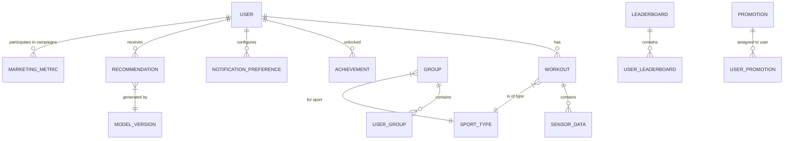

## Информационное представление

### ER-диаграмма доменной модели

### Особенности реализации:

- **Пользовательские данные** хранятся в **PostgreSQL** (ACID, транзакции), включая профиль, сессии, роли.
- **Тренировки** хранятся в **PostgreSQL (запись)** и **MongoDB (чтение)** — разделение по CQRS.
- **Лидерборды** — в **ClickHouse** для быстрого анализа и агрегаций.
- **События и логи** — в **Apache Kafka** для event sourcing и replay.
- **AI модели и фичи** — в **S3 + Delta Lake** для версионирования данных и обучения.
- Все PII-данные шифруются (AES-256) перед сохранением.
