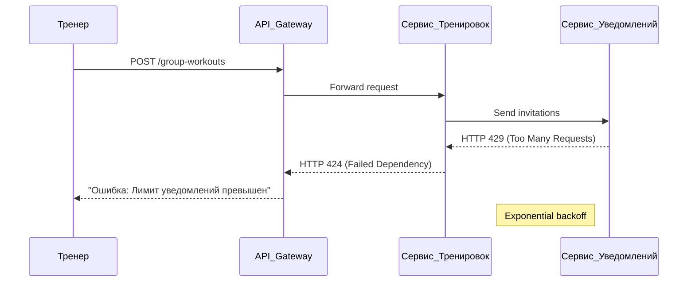

## Создание групповой тренировки

```mermaid
sequenceDiagram
    participant Тренер
    participant API_Gateway
    participant Сервис_Тренировок
    participant Сервис_Уведомлений
    
    Тренер->>API_Gateway: POST /group-workouts
    API_Gateway->>Сервис_Тренировок: Forward request
    Сервис_Тренировок->>Сервис_Уведомлений: Send invitations
    Сервис_Уведомлений-->>Сервис_Тренировок: HTTP 429 (Too Many Requests)
    Сервис_Тренировок-->>API_Gateway: HTTP 424 (Failed Dependency)
    API_Gateway-->>Тренер: "Ошибка: Лимит уведомлений превышен"
    note left of Сервис_Уведомлений: Exponential backoff
```