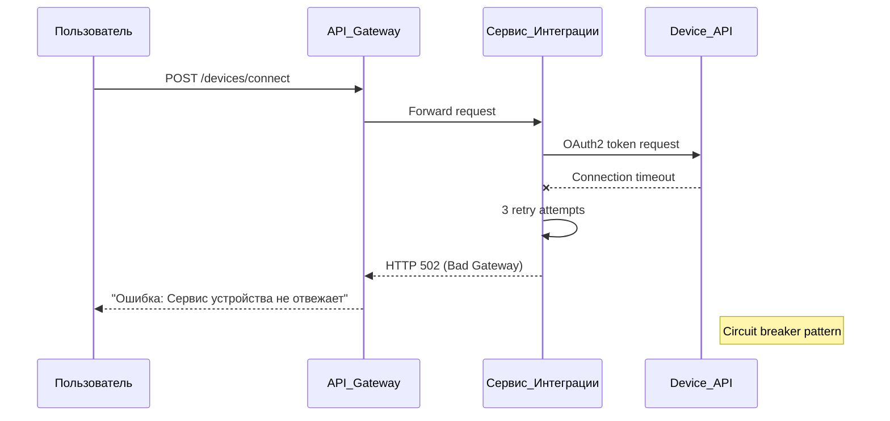

## Интеграция с фитнес-устройством 

```mermaid
sequenceDiagram
    participant Пользователь
    participant API_Gateway
    participant Сервис_Интеграции
    participant Device_API
    
    Пользователь->>API_Gateway: POST /devices/connect
    API_Gateway->>Сервис_Интеграции: Forward request
    Сервис_Интеграции->>Device_API: OAuth2 token request
    Device_API--x Сервис_Интеграции: Connection timeout
    Сервис_Интеграции->>Сервис_Интеграции: 3 retry attempts
    Сервис_Интеграции-->>API_Gateway: HTTP 502 (Bad Gateway)
    API_Gateway-->>Пользователь: "Ошибка: Сервис устройства не отвежает"
    note right of Device_API: Circuit breaker pattern
```