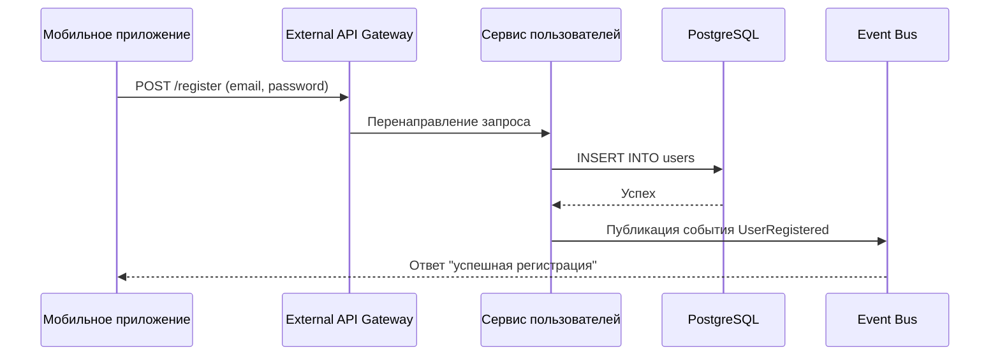
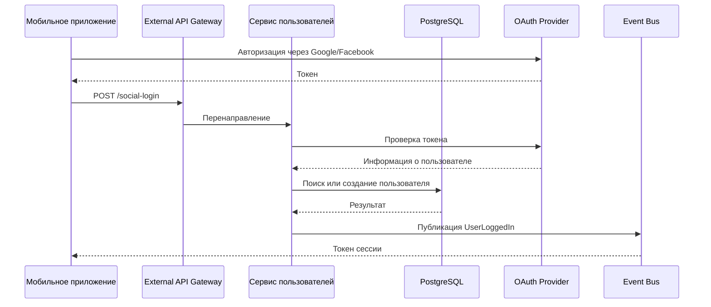
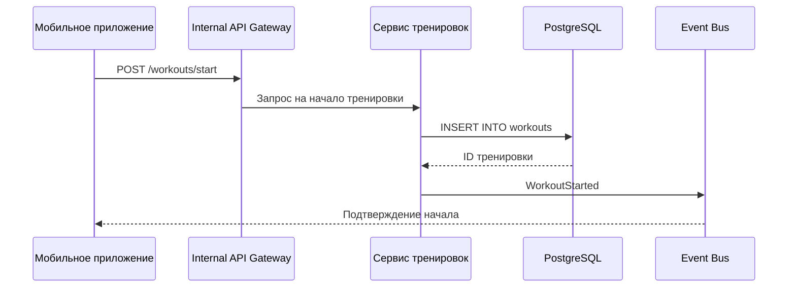
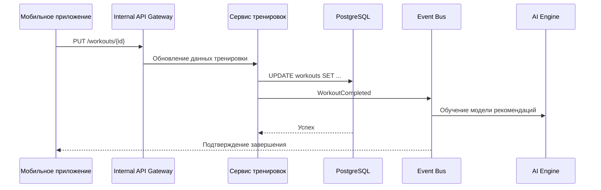
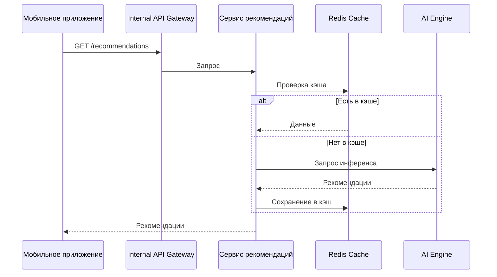
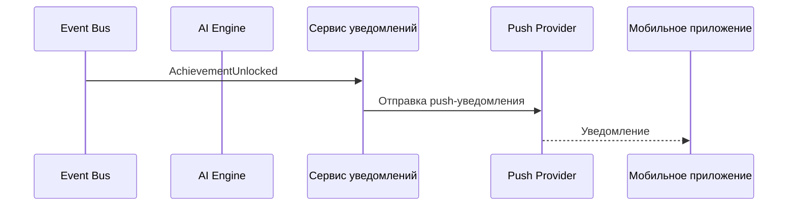
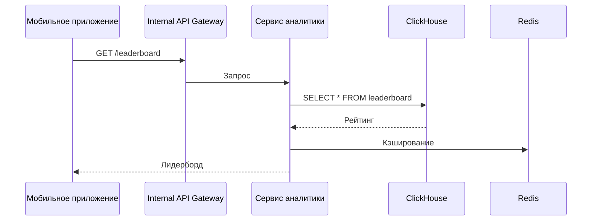
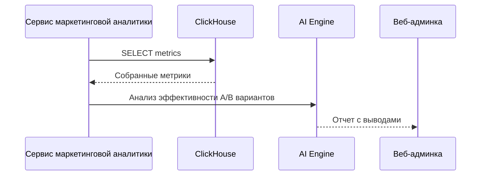
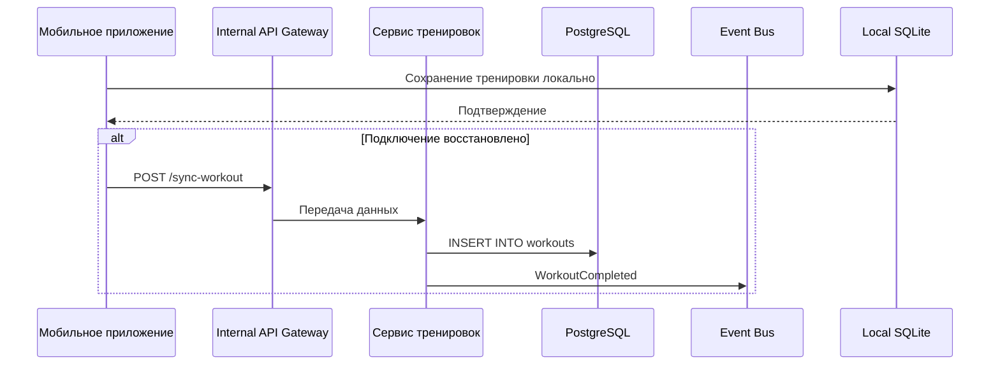
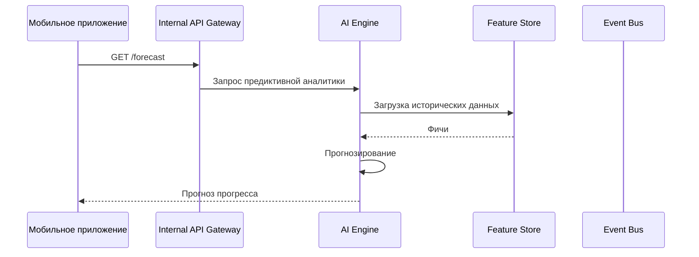

## 🎯 Сценарий 1: Пользователь регистрируется через email

### Описание:
Пользователь проходит регистрацию через email и пароль. Данные сохраняются в реляционной БД. Генерируется событие `UserRegistered`, которое может запустить welcome-нотификацию или начисление бонусных баллов.

---

## 🎯 Сценарий 2: Вход через социальные сети

### Описание:
Поддержка входа через соцсети реализована через OAuth. При успешном входе генерируется событие `UserLoggedIn`.

---

## 🎯 Сценарий 3: Запись тренировки (в online-режиме)

### Описание:
Пользователь начинает тренировку, фиксируется стартовое событие. Все данные о маршруте и показаниях датчиков будут отправлены отдельно и обработаны позже.

---

## 🎯 Сценарий 4: Завершение тренировки и отправка данных с GPS

### Описание:
После окончания тренировки отправляются полные данные (маршрут, показания датчиков). Это событие триггерит машинное обучение для дальнейших рекомендаций.

---

## 🎯 Сценарий 5: Получение персонализированной рекомендации

### Описание:
Рекомендации по тренировкам могут быть получены из кэша или сгенерированы динамически через AI-движок.

---

## 🎯 Сценарий 6: Отправка push-уведомления о достижении друга

### Описание:
Событие `AchievementUnlocked` подписывается сервисом уведомлений, который рассылает соответствующие push-сообщения друзьям пользователя.

---

## 🎯 Сценарий 7: Просмотр лидерборда

### Описание:
Лидерборды получаются из колоночной базы данных (ClickHouse) и кэшируются для оптимизации последующих запросов.

---

## 🎯 Сценарий 8: А/В тестирование маркетинговой промоакции

### Описание:
Маркетологи проводят A/B тестирование промоакций. После сбора данных система анализирует эффективность и предоставляет отчет.

---

## 🎯 Сценарий 9: Синхронизация офлайн-тренировки

### Описание:
Пользователь тренируется без интернета. Данные сохраняются локально и отправляются при восстановлении связи.

---

## 🎯 Сценарий 10: Получение прогноза прогресса

### Описание:
AI Engine использует данные о предыдущих тренировках для прогнозирования будущего прогресса пользователя.
