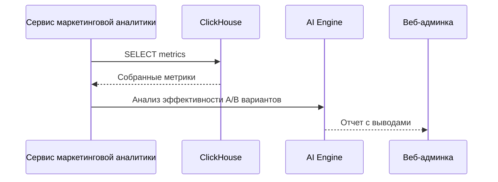

## А/В тестирование маркетинговой промоакции

```mermaid
sequenceDiagram
    participant MK as Сервис маркетинговой аналитики
    participant DB as ClickHouse
    participant A as AI Engine
    participant UI as Веб-админка

    MK->>DB: SELECT metrics
    DB-->>MK: Собранные метрики
    MK->>A: Анализ эффективности A/B вариантов
    A-->>UI: Отчет с выводами
```

### Описание:
Маркетологи проводят A/B тестирование промоакций. После сбора данных система анализирует эффективность и предоставляет отчет.