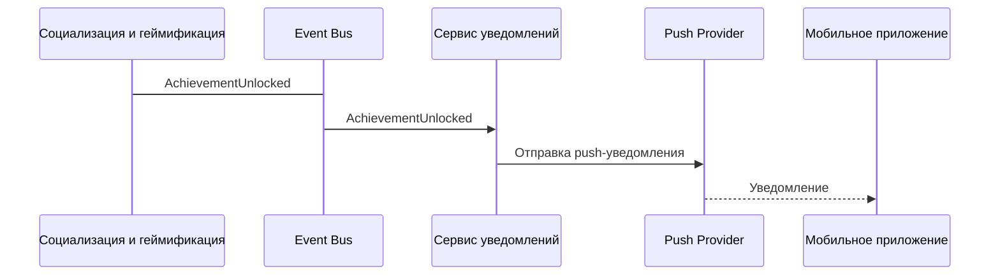

## Отправка push-уведомления о достижении друга

### Описание:
Событие `AchievementUnlocked` подписывается сервисом уведомлений, который рассылает соответствующие push-сообщения друзьям пользователя.