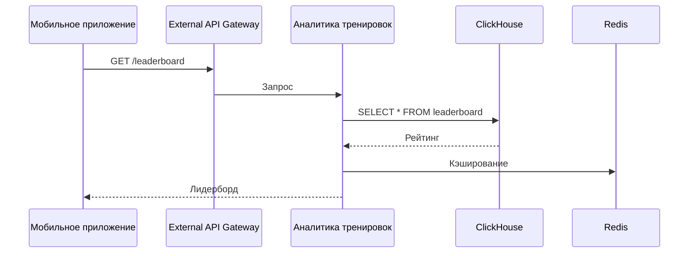

## Просмотр лидерборда

```mermaid
sequenceDiagram
    participant M as Мобильное приложение
    participant A as External API Gateway
    participant TA as Аналитика тренировок
    participant CH as ClickHouse
    participant C as Redis

    M->>A: GET /leaderboard
    A->>TA: Запрос
    TA->>CH: SELECT * FROM leaderboard
    CH-->>TA: Рейтинг
    TA->>C: Кэширование
    TA-->>M: Лидерборд
```

### Описание:
Лидерборды получаются из колоночной базы данных и кэшируются для оптимизации последующих запросов.