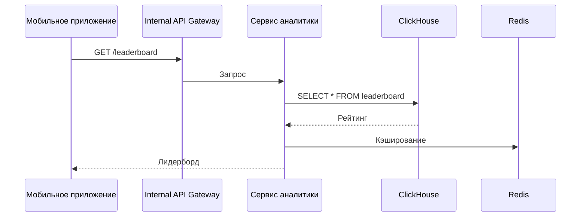

## Просмотр лидерборда

```mermaid
sequenceDiagram
    participant M as Мобильное приложение
    participant A as Internal API Gateway
    participant AN as Сервис аналитики
    participant CH as ClickHouse
    participant C as Redis

    M->>A: GET /leaderboard
    A->>AN: Запрос
    AN->>CH: SELECT * FROM leaderboard
    CH-->>AN: Рейтинг
    AN->>C: Кэширование
    AN-->>M: Лидерборд
```

### Описание:
Лидерборды получаются из колоночной базы данных (ClickHouse) и кэшируются для оптимизации последующих запросов.