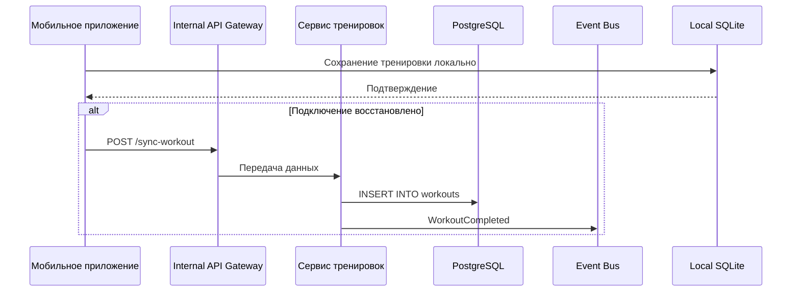

## Синхронизация офлайн-тренировки

```mermaid
sequenceDiagram
    participant M as Мобильное приложение
    participant A as Internal API Gateway
    participant W as Сервис тренировок
    participant DB as PostgreSQL
    participant E as Event Bus
    participant L as Local SQLite

    M->>L: Сохранение тренировки локально
    L-->>M: Подтверждение
    alt Подключение восстановлено
        M->>A: POST /sync-workout
        A->>W: Передача данных
        W->>DB: INSERT INTO workouts
        W->>E: WorkoutCompleted
    end
```

### Описание:
Пользователь тренируется без интернета. Данные сохраняются локально и отправляются при восстановлении связи.