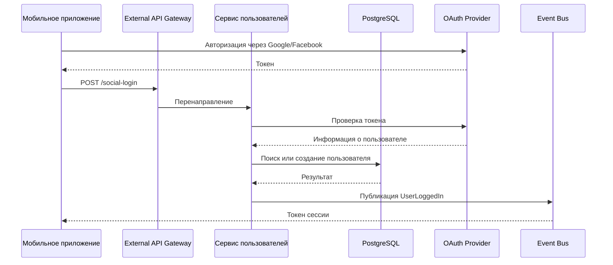

## Вход через социальные сети

```mermaid
sequenceDiagram
    participant M as Мобильное приложение
    participant A as External API Gateway
    participant U as Сервис пользователей
    participant DB as PostgreSQL
    participant S as OAuth Provider
    participant E as Event Bus

    M->>S: Авторизация через Google/Facebook
    S-->>M: Токен
    M->>A: POST /social-login
    A->>U: Перенаправление
    U->>S: Проверка токена
    S-->>U: Информация о пользователе
    U->>DB: Поиск или создание пользователя
    DB-->>U: Результат
    U->>E: Публикация UserLoggedIn
    E-->>M: Токен сессии
```

### Описание:
Поддержка входа через соцсети реализована через OAuth. При успешном входе генерируется событие `UserLoggedIn`.