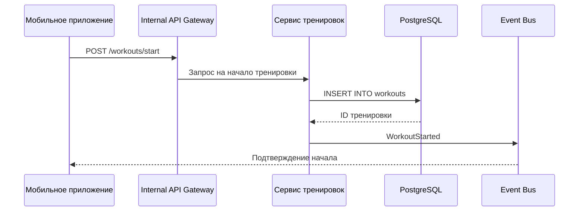

## Запись тренировки (в online-режиме)

### Описание:
Пользователь начинает тренировку, фиксируется стартовое событие. Все данные о маршруте и показаниях датчиков будут отправлены отдельно и обработаны позже.