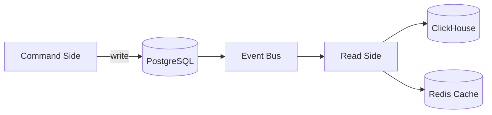

# Анализ архитектурных опций и обоснование выбора

## Ключевые архитектурные решения

### Рассматриваемые подходы
С учетом требований к масштабируемости, гибкости и отказоустойчивости предлагается рассмотреть:

1. **Микросервисная архитектура (MSA)**
2. **Serverless-архитектура**
3. **Гибридный подход (80% MSA + 20% Serverless)**

### Сравнительный анализ

| Критерий          | Микросервисы       | Serverless         | Гибридный подход   |
|-------------------|--------------------|--------------------|--------------------|
| **Контроль**      | Полный контроль    | Ограниченный       | Избирательный      |
| **Холодный старт**| Нет проблемы       | Критично для real-time | Только фоновые задачи |
| **Vendor lock-in**| Минимальный        | Максимальный       | Частичный          |
| **Стоимость**     | Высокая на старте  | Экономия на масштабе | Оптимальный баланс |
| **Геораспределение**| Любые регионы    | Только регионы провайдера | Гибкая настройка |
| **AI/ML-поддержка**| Полный контроль (GPU, кастомные модели)    | Ограничено (Lambda timeout, нет GPU) | Оптимально: обучение в MSA, инференс в Serverless |

## Обоснование выбора гибридной архитектуры

**Core-сервисы и сервисы с чувствтельными данными (микросервисы):**
- Пользователи и безопасность
- Тренировки (Core Domain)
- Оплаты и транзакции

**Serverless-компоненты:**
- Фоновые задачи (нотификации, аналитика)
- Обработка событий
- Временные промо-акции

**Преимущества:**
- Сочетание контроля и экономической эффективности
- Гибкое масштабирование под нагрузку
- Минимизация операционных расходов на фоновые процессы

## Детализация архитектурных решений

### 1. Event-Driven Architecture (EDA)

**Проблемы, которые решает:**
- Жесткая связь между сервисами
- Проблемы с latency при высоких нагрузках
- Низкая отказоустойчивость прямых вызовов

**Реализация:**
- **Основной брокер:** Apache Kafka
- **Real-time уведомления:** NATS JetStream
- **Паттерны:**
  - Event Sourcing для критичных данных
  - Pub/Sub для уведомлений
  - CQRS для разделения нагрузки

### 2. CQRS (Command Query Responsibility Segregation)

**Применение:**
- Сервис тренировок (разделение записи и чтения)
- Аналитика пользователей
- Лидерборды

**Схема реализации:**


### 3. Распределенность данных

**Стратегия:**
- **Primary DC:** ЦОД-1 (основной)
- **Secondary DC:** ЦОД-2 (горячий резерв)
- **Tertiary DC:** ЦОД-3 (холодный резерв)

**Модель репликации:**
- Синхронная репликация между Primary и Secondary
- Асинхронная в Tertiary (задержка ≤5 мин)
- Кворумная запись (2 из 3 для критичных операций)

### 4. AI-стек и интеграция  
**Реализация:**  
- **Data Pipeline:**  
  - Сбор данных: Kafka → S3.  
  - Предобработка: Apache Spark.  
- **Обучение моделей:**  
  - Фреймворки: PyTorch (персонализация), XGBoost (аналитика).  
  - Инференс: TensorFlow Serving (микросервис) + AWS Lambda (для легких моделей).  
- **Интеграция с Event Bus:**  
  - События типа `UserMetricsUpdated` триггерят пересчет рекомендаций.  

**Пример схемы:**  
```mermaid  
graph LR  
    A[Тренировки MS] -->|Данные| B[AI Service]  
    B -->|Рекомендации| C[Кэш Redis]  
    C --> D[Мобильное приложение]  
    B -->|Аналитика| E[ClickHouse]

## Целевой стек технологий (детализация)

### Бэкенд
| Компонент       | Технологии                          | Обоснование                     |
|-----------------|-------------------------------------|---------------------------------|
| Языки          | Go, Python, Kotlin                 | Баланс производительности и скорости разработки |
| Фреймворки     | Gin, FastAPI, Spring               | Поддержка cloud-native паттернов |
| Event Bus      | Kafka + NATS JetStream             | Надежность + real-time возможности |

### Фронтенд
| Платформа      | Технологии                         | Преимущества                    |
|----------------|------------------------------------|---------------------------------|
| Мобильные      | React Native + нативные модули     | Кроссплатформенность + доступ к железу |
| Web            | Next.js                            | SSR + SEO + современный UX      |

### Базы данных
| Тип данных     | Технологии                         | Сценарии использования          |
|----------------|------------------------------------|---------------------------------|
| Реляционные   | PostgreSQL + TimescaleDB           | Транзакции + временные ряды     |
| Документные   | MongoDB Atlas                      | Гибкие схемы (профили пользователей) |
| Колоночные    | ClickHouse                         | Аналитика в реальном времени    |
| Кэш           | Redis Cluster                      | Сессии, лидерборды              |

### AI/ML
| Компонент       | Технологии                          | Обоснование                     |  
|-----------------|-------------------------------------|---------------------------------|  
| AI/ML      | PyTorch, TensorFlow Serving, MLflow | Поддержка GPU + экспериментов   |  
| Data Lake  | S3 + Delta Lake                     | Хранение данных для обучения    |  
| Инференс | FastAPI + AWS Lambda | Баланс latency/стоимости       |

## Схема развертывания (детализация)

### Multi-cloud стратегия
```mermaid
graph TD
    A[Primary: ЦОД-1] -->|Гео-репликация| B[ЦОД-2]
    A -->|Асинхронная репликация| C[ЦОД-3]
    D[CDN: CloudFront+Cloudflare] --> A
    D --> B
    D --> C
```

**Критерии распределения:**
1. **Глобальные сервисы:**
   - Аутентификация
   - API Gateway
   - Event Bus

2. **Региональные сервисы:**
   - Тренировки (данные хранятся в регионе пользователя)
   - Персональные рекомендации

3. **Статический контент:**
   - CDN с гео-роутингом
   - Edge-функции для персонализации

## Выбор вендорных vs собственных решений

| Компонент       | Решение            | Обоснование                     |
|-----------------|--------------------|---------------------------------|
| Базы данных    | Вендорные (AWS RDS, MongoDB Atlas) | Снижение operational overhead |
| CI/CD          | GitLab SaaS        | Интеграция с остальным стеком   |
| Мониторинг     | Собственное на OpenTelemetry | Полный контроль метрик      |
| Аутентификация | Собственное решение + Auth0 | Баланс кастомизации и готовых функций |
| AI/ML | ССобственные модели + SageMaker (обучение) | Контроль данных + использование managed-инференса |

**Ключевые факторы выбора:**
1. Для core-компонентов - собственные решения
2. Для инфраструктурных - managed-сервисы
3. Гибридные подходы для критичных бизнес-процессов