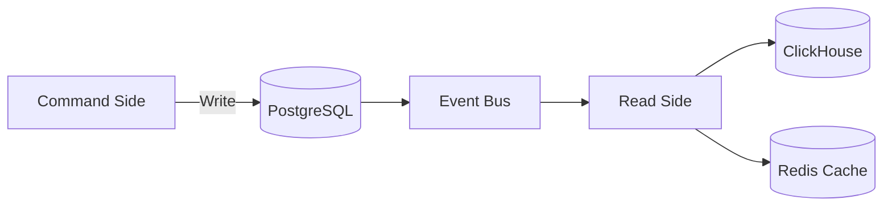
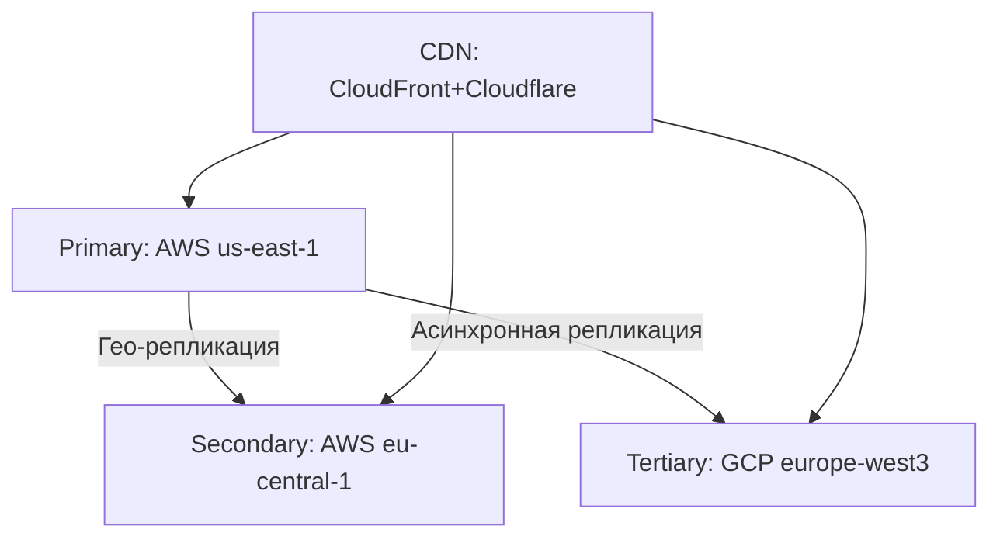

# Анализ архитектурных опций и обоснование выбора

## Ключевые архитектурные решения

### Рассматриваемые подходы
С учетом требований к масштабируемости, гибкости и отказоустойчивости предлагается рассмотреть:

1. **Микросервисная архитектура (MSA)**
2. **Serverless-архитектура**
3. **Гибридный подход (80% MSA + 20% Serverless)**

### Сравнительный анализ

| Критерий          | Микросервисы       | Serverless         | Гибридный подход   |
|-------------------|--------------------|--------------------|--------------------|
| **Контроль**      | Полный контроль    | Ограниченный       | Избирательный      |
| **Холодный старт**| Нет проблемы       | Критично для real-time | Только фоновые задачи |
| **Vendor lock-in**| Минимальный        | Максимальный       | Частичный          |
| **Стоимость**     | Высокая на старте  | Экономия на масштабе | Оптимальный баланс |
| **Геораспределение**| Любые регионы    | Только регионы провайдера | Гибкая настройка |

## Обоснование выбора гибридной архитектуры

**Core-сервисы (микросервисы):**
- Пользователи и безопасность
- Тренировки (Core Domain)
- Оплаты и транзакции

**Serverless-компоненты:**
- Фоновые задачи (нотификации, аналитика)
- Обработка событий
- Временные промо-акции

**Преимущества:**
- Сочетание контроля и экономической эффективности
- Гибкое масштабирование под нагрузку
- Минимизация операционных расходов на фоновые процессы

## Детализация архитектурных решений

### 1. Event-Driven Architecture (EDA)

**Проблемы, которые решает:**
- Жесткая связь между сервисами
- Проблемы с latency при высоких нагрузках
- Низкая отказоустойчивость прямых вызовов

**Реализация:**
- **Основной брокер:** Apache Kafka (доставка событий)
- **Real-time уведомления:** NATS JetStream
- **Паттерны:**
  - Event Sourcing для критичных данных
  - Pub/Sub для уведомлений
  - CQRS для разделения нагрузки

### 2. CQRS (Command Query Responsibility Segregation)

**Применение:**
- Сервис тренировок (разделение записи и чтения)
- Аналитика пользователей
- Лидерборды

**Схема реализации:**

### 3. Распределенность данных

**Стратегия:**
- **Primary DC:** AWS us-east-1 (основной)
- **Secondary DC:** AWS eu-central-1 (горячий резерв)
- **Tertiary DC:** GCP europe-west3 (холодный резерв)

**Модель репликации:**
- Синхронная репликация между Primary и Secondary
- Асинхронная в Tertiary (задержка ≤5 мин)
- Кворумная запись (2 из 3 для критичных операций)

## Целевой стек технологий (детализация)

### Бэкенд
| Компонент       | Технологии                          | Обоснование                     |
|-----------------|-------------------------------------|---------------------------------|
| Языки          | Go, Python, Kotlin                 | Баланс производительности и скорости разработки |
| Фреймворки     | Gin, FastAPI, Spring               | Поддержка cloud-native паттернов |
| Event Bus      | Kafka + NATS JetStream             | Надежность + real-time возможности |

### Фронтенд
| Платформа      | Технологии                         | Преимущества                    |
|----------------|------------------------------------|---------------------------------|
| Мобильные      | React Native + нативные модули     | Кроссплатформенность + доступ к железу |
| Web            | Next.js 13 (App Router)            | SSR + SEO + современный UX      |

### Базы данных
| Тип данных     | Технологии                         | Сценарии использования          |
|----------------|------------------------------------|---------------------------------|
| Реляционные   | PostgreSQL + TimescaleDB           | Транзакции + временные ряды     |
| Документные   | MongoDB Atlas                      | Гибкие схемы (профили пользователей) |
| Колоночные    | ClickHouse                         | Аналитика в реальном времени    |
| Кэш           | Redis Cluster                      | Сессии, лидерборды              |

## Схема развертывания (детализация)

### Multi-cloud стратегия

**Критерии распределения:**
1. **Глобальные сервисы:**
   - Аутентификация
   - API Gateway
   - Event Bus

2. **Региональные сервисы:**
   - Тренировки (данные хранятся в регионе пользователя)
   - Персональные рекомендации

3. **Статический контент:**
   - CDN с гео-роутингом
   - Edge-функции для персонализации

## Выбор вендорных vs собственных решений

| Компонент       | Решение            | Обоснование                     |
|-----------------|--------------------|---------------------------------|
| Базы данных    | Вендорные (AWS RDS, MongoDB Atlas) | Снижение operational overhead |
| CI/CD          | GitLab SaaS        | Интеграция с остальным стеком   |
| Мониторинг     | Собственное на OpenTelemetry | Полный контроль метрик      |
| Аутентификация | Собственное решение + Auth0 | Баланс кастомизации и готовых функций |

**Ключевые факторы выбора:**
1. Для core-компонентов - собственные решения
2. Для инфраструктурных - managed-сервисы
3. Гибридные подходы для критичных бизнес-процессов