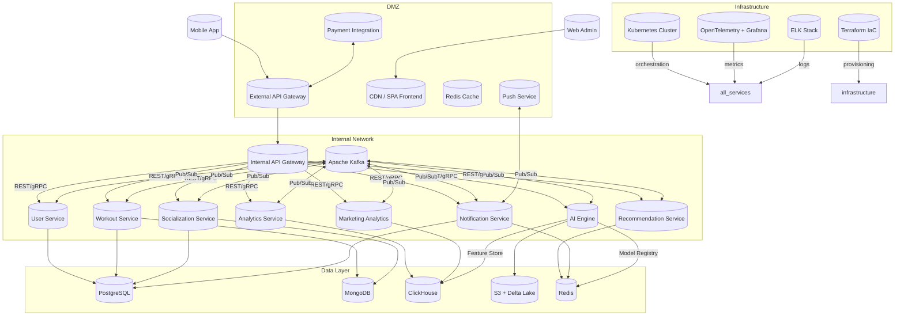
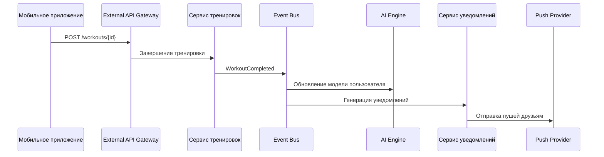

# Базовая архитектура

---

## Общая цель архитектуры

Создать **масштабируемую, отказоустойчивую, безопасную и высокопроизводительную систему**, которая:
- Поддерживает ключевые бизнес-цели: вовлеченность, персонализация, монетизация.
- Соответствует всем нефункциональным требованиям (НФТ).
- Адресует критичные атрибуты качества: надежность, безопасность, функциональность, производительность.

---

## Архитектурный стиль

### Используемый подход
**Гибридная архитектура на основе:**
- **Микросервисной архитектуры (MSA)** — для core-сервисов.
- **Serverless** — для фоновых задач, аналитики и обработки событий.
- **Event-Driven Architecture (EDA)** — для loose coupling между сервисами.
- **CQRS** — для разделения операций чтения и записи.
- **Multi-cloud стратегия** — для георезервирования и масштабируемости.

---

## Высокоуровневая схема архитектуры

---

## Связь с бизнес-требованиями

| Бизнес-требование | Реализующие компоненты |
|-------------------|-------------------------|
| **1. Повышение вовлечённости** | Socialization Service, Leaderboard (ClickHouse), AI Recommendations, Push Notifications |
| **2. Персонализация через данные** | AI Engine, Feature Store, Workout Tracking, CQRS |
| **3. Интеграция с экосистемой** | Recommendation Service, Marketing Analytics, Payment Gateway |
| **4. Безопасность и доступность** | External/Internal API Gateways, Redis Cache, CDN, GDPR-compliant DB policies |

---

## Учет нефункциональных требований (НФТ)

| Категория | Требование | Как реализовано |
|----------|-------------|------------------|
| **Производительность** | ≤ 500 мс отклик, ≤ 1 сек задержка обновления | Caching (Redis), CDN, Event Sourcing, Async processing |
| **Масштабируемость** | Горизонтальное масштабирование, шардинг | Kubernetes, Kafka, Multi-DC, Sharding PostgreSQL |
| **Надежность** | RTO ≤ 15 мин, RPO ≤ 1 мин | Geo-replication, Backup policies, Failover strategies |
| **Безопасность** | TLS 1.3, E2EE, 2FA, GDPR | Mutual TLS, JWT, IAM, Encryption at rest/in-transit |
| **Совместимость** | RESTful API, OpenAPI, Wearables | API Gateway, Device SDKs, Fitness API integrations |
| **Удобство использования** | Offline режим, голосовое управление | SQLite caching, React Native native modules |
| **Поддерживаемость** | CI/CD, документация, логирование | GitLab CI, Swagger/OpenAPI, ELK, Terraform |
| **Инфраструктура** | Docker/K8s, IaC | Helm charts, Kustomize, Terraform modules |
| **Локализация** | 10+ языков, региональные промоакции | Feature flags, i18n libraries, geo-routing CDN |

---

## Адресация атрибутов качества

| Атрибут качества | Уровень важности | Как обеспечивается |
|------------------|------------------|---------------------|
| **Надежность** | Критический | Geo-replication, backups, circuit breakers, retries |
| **Масштабируемость** | Высокий | Kubernetes autoscaling, Kafka partitions, multi-region |
| **Безопасность** | Критический | TLS, JWT, RBAC, SIEM, encryption, pentests |
| **Функциональность** | Критический | Domain-driven design, BDD, unit tests, integration tests |
| **Совместимость** | Средний | Cross-platform mobile, REST APIs, device SDKs |
| **Производительность** | Высокий | Caching, CDNs, async writes, read replicas |
| **Удобство использования** | Высокий | Offline sync, UI/UX testing, voice control |
| **Результативность** | Высокий | AI recommendations, A/B testing, analytics dashboards |
| **Поддерживаемость** | Базовый | CI/CD, logs/metrics, code reviews, documentation |
| **Доступность** | Базовый | WCAG AA compliance, screen reader support |

---

## Детализация по слоям

### 1. **Клиентский уровень**
- **Мобильное приложение:** React Native + нативные модули (GPS, Bluetooth)
- **Веб-админка:** Next.js + GraphQL
- **Оффлайн-режим:** Локальное хранение тренировок в SQLite
- **Push-уведомления:** NATS JetStream + Firebase Cloud Messaging

### 2. **API-уровень**
- **External API Gateway**: Для клиентских запросов, аутентификации, rate limiting
- **Internal API Gateway**: Для взаимодействия микросервисов, авторизации, маршрутизации
- **Analytics API Gateway**: Для тяжелых аналитических запросов

### 3. **Сервисный уровень**
- **Пользователи и безопасность**: Регистрация, сессии, социальный вход
- **Тренировки**: Запись GPS, показания датчиков, анализ
- **Социализация**: Чаты, группы, достижения, уведомления
- **Рекомендации**: AI-подбор тренировок, акций
- **Аналитика**: Лидерборды, сравнение, прогнозирование
- **Маркетинг**: A/B тестирование, сегментация, CRM интеграция
- **Уведомления**: Push, email, внутриприложные сообщения
- **AI Engine**: Обучение моделей, инференс, feature store

### 4. **Уровень данных**
- **Реляционные БД (PostgreSQL):** Пользователи, тренировки, уведомления
- **Документоориентированные (MongoDB):** Профили, рекомендации
- **Колоночные (ClickHouse):** Аналитика, лидерборды
- **Кэширование (Redis):** Сессии, рейтинги, кэш рекомендаций
- **Хранилище данных для AI (S3 + Delta Lake):** Хранение сырых данных, версионирование

### 5. **Инфраструктурный уровень**
- **Kubernetes**: Оркестрация микросервисов
- **Terraform**: IaC для AWS/GCP
- **OpenTelemetry + Prometheus + Grafana**: Мониторинг и метрики
- **ELK Stack**: Централизованное логирование
- **CI/CD**: GitLab CI с автоматическими деплоями

---

## Стратегия обеспечения безопасности

- **Шифрование:** TLS 1.3, AES-256, E2EE для чатов
- **Аутентификация:** JWT, 2FA, OAuth2
- **GDPR/CCPA:** Политики удаления данных, consent management
- **Мониторинг угроз:** SIEM с корреляцией событий
- **Защита от DDoS:** WAF + Cloudflare + AWS Shield

---

## Пример потока данных: пользователь завершил тренировку

