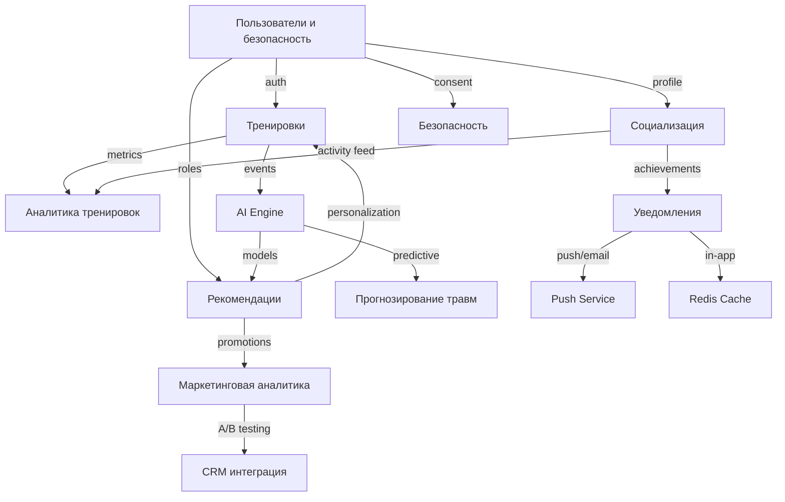
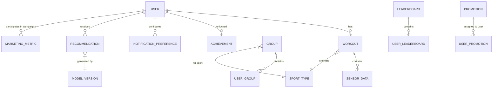
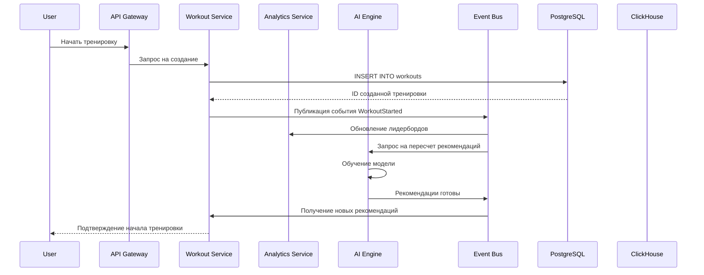
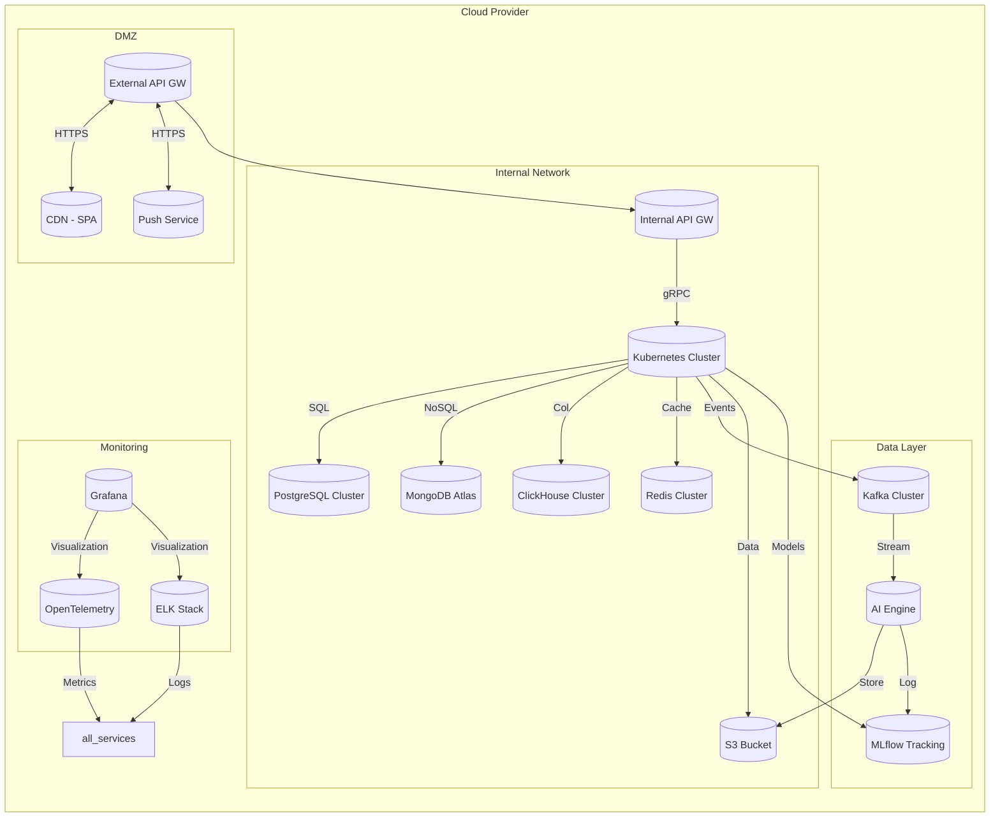
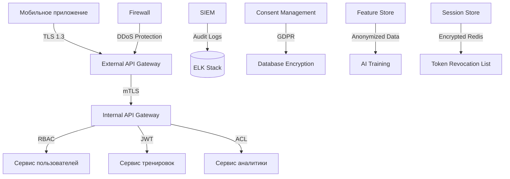

# Основные представления архитектуры

## 1. Функциональное представление

### Структура модулей

### Особенности реализации:
- **Пользователи и безопасность** — центральный сервис, от которого зависят почти все остальные.
- **CQRS** используется в **тренировках** и **аналитике**: запись идёт через реляционную БД, чтение — через документоориентированную/колоночную.
- **Event Sourcing** применяется для критичных событий (например, `UserRegistered`, `WorkoutCompleted`).
- **AI Engine** подписывается на события и генерирует рекомендации, которые публикуются обратно в систему.

---

## 2. Информационное представление

### 💡 Особенности реализации:
- **Пользовательские данные** хранятся в **PostgreSQL** (ACID, транзакции), включая профиль, сессии, роли.
- **Тренировки** хранятся в **PostgreSQL (запись)** и **MongoDB (чтение)** — разделение по CQRS.
- **Лидерборды** — в **ClickHouse** для быстрого анализа и агрегаций.
- **События и логи** — в **Apache Kafka** для event sourcing и replay.
- **AI модели и фичи** — в **S3 + Delta Lake** для версионирования данных и обучения.

---

## 3. Многозадачность / Concurrency

### Особенности реализации:
- Используется **event-driven подход** для асинхронного обновления состояния других сервисов.
- **Kafka** гарантирует доставку событий даже при высокой нагрузке.
- **Redis** используется для кэширования частых операций (рейтинги, уведомления).
- **Async processing** для AI-инференса и аналитики позволяет избежать блокировки основного потока.

---

## 4. Инфраструктурное представление

### Особенности реализации:
- **Гибридная архитектура**: микросервисы + serverless для фоновых задач (AI-инференс, аналитика).
- **Multi-cloud стратегия**: Primary DC + Secondary (горячий) + Tertiary (холодный).
- **Infrastructure-as-Code**: Terraform + Helm обеспечивает автоматизированное развертывание.
- **CI/CD**: GitLab CI управляет сборкой, тестированием и деплоем.
- **Контейнеризация**: Docker + Kubernetes для всех сервисов.

---

## 5. Безопасность

### Особенности реализации:
- **DMZ** содержит только внешние точки входа: API Gateway, CDN, Push Service.
- Все внутренние вызоры осуществляются через **mutual TLS (mTLS)** и **JWT**.
- **Шифрование**: TLS 1.3 для передачи, AES-256 для хранения PII.
- **GDPR/CCPA Compliance**: политики удаления данных, consent management.
- **SIEM-система** коррелирует события из DMZ и внутренней сети для обнаружения аномалий.
- **AI-модели** обучаются на **анонимизированных данных** с применением дифференциальной приватности.
- **Сессии** и токены хранятся в зашифрованном Redis.
