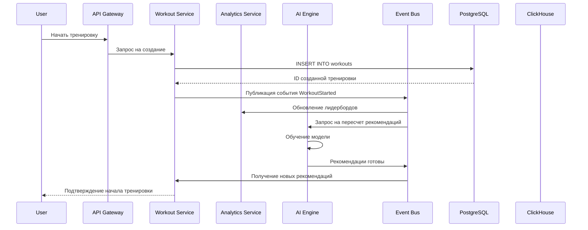

## Многозадачность / Concurrency

### Особенности реализации:
- Используется **event-driven подход** для асинхронного обновления состояния других сервисов.
- **Kafka** гарантирует доставку событий даже при высокой нагрузке.
- **Redis** используется для кэширования частых операций (рейтинги, уведомления).
- **Async processing** для AI-инференса и аналитики позволяет избежать блокировки основного потока.