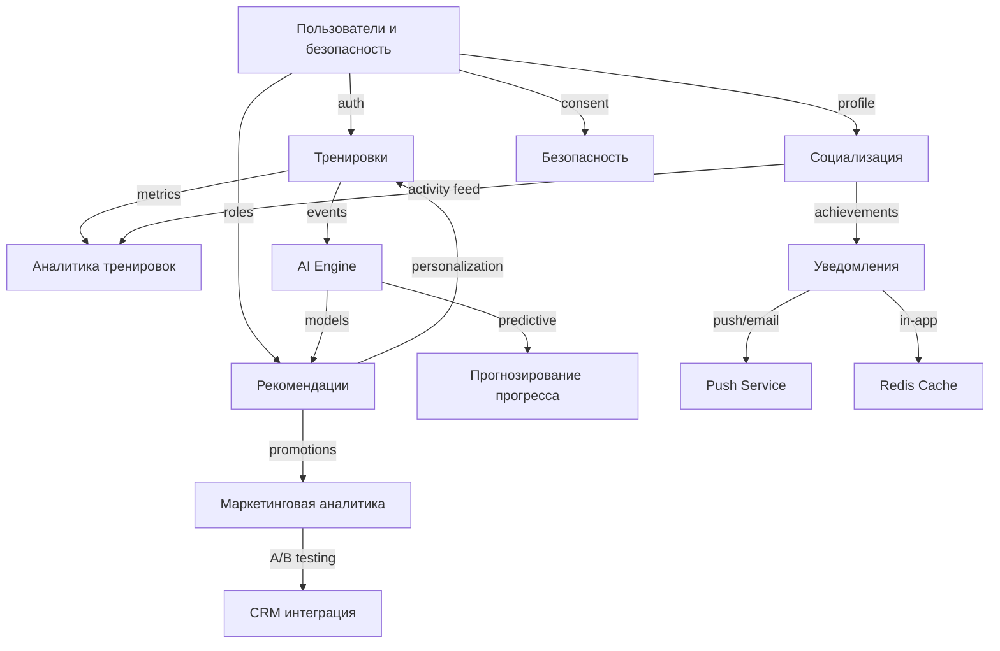

## Функциональное представление

### Структура модулей

### Особенности реализации:

- **Пользователи и безопасность** — центральный микросервис, от которого зависят почти все остальные.
- **CQRS** используется в **тренировках** и **аналитике**: запись — через PostgreSQL, чтение — через MongoDB / ClickHouse.
- **Event Sourcing** применяется для критичных событий: `UserRegistered`, `WorkoutStarted`, `WorkoutCompleted`.
- **AI Engine** подписывается на события и генерирует рекомендации/прогнозы, которые публикуются обратно в систему.
