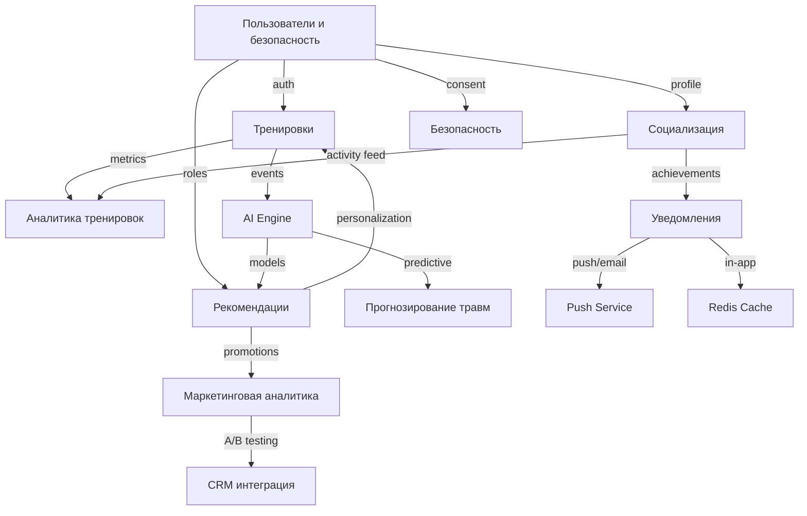

## Функциональное представление

### Структура модулей

### Особенности реализации:
- **Пользователи и безопасность** — центральный сервис, от которого зависят почти все остальные.
- **CQRS** используется в **тренировках** и **аналитике**: запись идёт через реляционную БД, чтение — через документоориентированную/колоночную.
- **Event Sourcing** применяется для критичных событий (например, `UserRegistered`, `WorkoutCompleted`).
- **AI Engine** подписывается на события и генерирует рекомендации, которые публикуются обратно в систему.