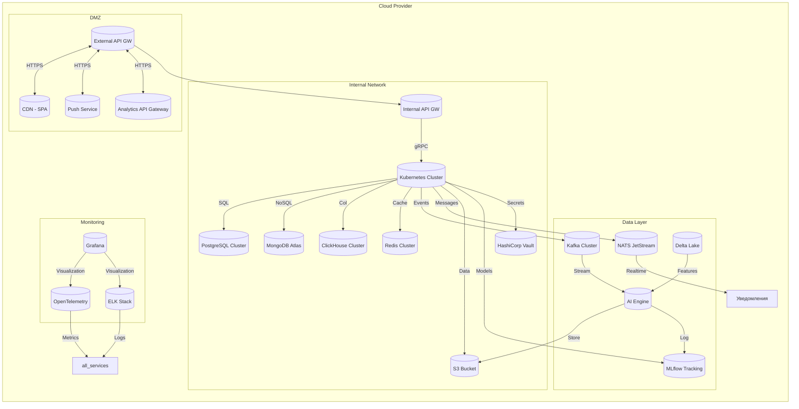

## Инфраструктурное представление

### Особенности реализации:

- **Гибридная архитектура**: микросервисы + serverless (Lambda) для фоновых задач (AI-инференс, аналитика).
- **Multi-cloud стратегия**: Primary DC + Secondary (горячий) + Tertiary (холодный).
- **Infrastructure-as-Code**: Terraform + Helm обеспечивает автоматизированное развертывание.
- **CI/CD**: GitLab CI управляет сборкой, тестированием и деплоем.
- **Контейнеризация**: Docker + Kubernetes для всех сервисов.
- **Шифрование**: TLS 1.3 для передачи, AES-256 для хранения PII.
