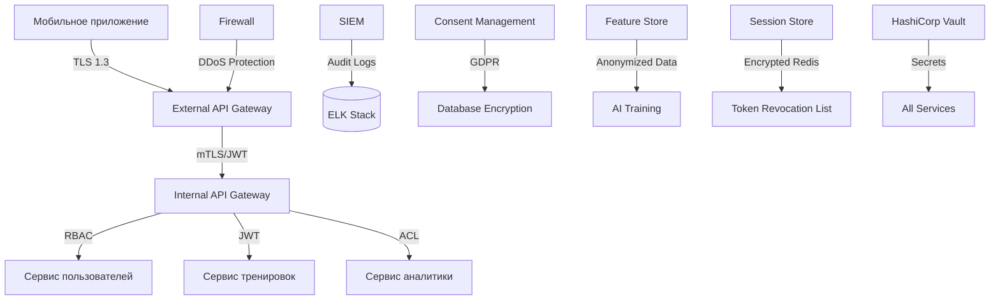

## Безопасность

### Особенности реализации:

- **DMZ** содержит только внешние точки входа: API Gateway, CDN, Push Service.
- Все внутренние вызовы осуществляются через **mutual TLS (mTLS)** и **JWT**.
- **Шифрование**: TLS 1.3 для передачи, AES-256 для хранения PII.
- **GDPR/CCPA Compliance**: политики удаления данных, consent management.
- **SIEM-система** коррелирует события из DMZ и внутренней сети для обнаружения аномалий.
- **AI-модели** обучаются на **анонимизированных данных** с применением дифференциальной приватности.
- **Сессии** и токены хранятся в зашифрованном Redis.
- **HashiCorp Vault** управляет секретами и сертификатами.
