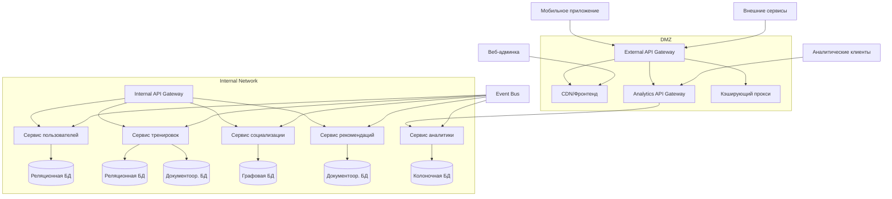

# Концептуальная архитектура фитнес-приложения с социальными и геймификационными компонентами

## Концепция
**Микросервисная архитектура с Event-Driven и CQRS выбрана потому что:**
- **Масштабируемость**: Возможность независимо масштабировать сервисы с разной нагрузкой
- **Гибкость**: Разные БД под конкретные задачи
- **Отказоустойчивость**: Изолированные сервисы минимизируют каскадные сбои
- **Производительность**: CQRS разделяет нагрузку чтения/записи
- **Безопасность**: Возможность изолировать критические компоненты в DMZ

## Детализация выбора БД

| Сервис                | Тип БД              | Обоснование                                                                 |
|-----------------------|---------------------|-----------------------------------------------------------------------------|
| Пользователи          | Реляционная         | Транзакционность, целостность данных, сложные JOIN-запросы                 |
| Тренировки (запись)   | Реляционная         | ACID-требования для корректности данных                                    |
| Тренировки (чтение)   | Документоориентированная | Гибкость для хранения JSON-треков (GPS), быстрый доступ                   |
| Социализация          | Графовая            | Эффективные запросы связей (друзья, группы)                                |
| Кэш                   | Redis               | Скорость для сессий, рейтингов, уведомлений                               |
| Аналитика             | Колоночная          | Оптимальна для агрегации больших объёмов данных                           |
| Логи                  | ELK + Grafana       | Быстрый поиск и анализ логов                                              |

## Безопасность
- **DMZ (Demilitarized Zone)**:
  - Внешний API Gateway для клиентских приложений
  - Серверы статического фронтенда (SPA)
  - Кэширующие прокси для снижения нагрузки
  - Изолированная сеть с ограниченным доступом к внутренним сервисам

- **Internal API Gateway**:
  - Аутентификация внутренних сервисов через mutual TLS
  - Балансировка нагрузки между микросервисами
  - Дополнительный уровень авторизации

- **API Gateway для аналитики** (отдельный):
  - Специфичные политики rate limiting для аналитических запросов
  - Оптимизированные кэш-стратегии для агрегированных данных
  - Поддержка тяжелых аналитических запросов

**Дополнительные меры:**
- **Шифрование**:
  - TLS 1.3 для всех соединений
  - Данные пользователей шифруются при хранении с разделением ключей
- **Согласия (GDPR/CCPA)**:
  - Сервис "Consent Management" с журналированием всех изменений
- **Мониторинг угроз**:
  - SIEM-система с корреляцией событий из DMZ и внутренней сети

## Frontend
- **Клиентские приложения** размещаются в DMZ:
  - Статические файлы SPA обслуживаются через CDN
  - API-запросы идут через External API Gateway
  - Ограниченный доступ к внутренним ресурсам

**Мобильное приложение:**
- Кроссплатформенность: React Native с нативными модулями для точного GPS
- Оффлайн-режим: Кэширование тренировок в SQLite с двухэтапной синхронизацией (через DMZ)
- Производительность: Оптимизация под слабые сети с префетчингом через Analytics API Gateway

**Веб-админка:**
- Технологии: SPA на React + GraphQL с разделением на:
  - Public API (через External API Gateway)
  - Admin API (через Internal API Gateway)
- Доступность: WCAG 2.1 AA + изолированные роли доступа

## Критически важные интеграции
- **Платежи**: Двойная маршрутизация - публичные платежи через DMZ, админские через внутренний gateway
- **Фитнес-гаджеты**: Разделение на:
  - Публичные интеграции (через DMZ)
  - Привилегированные партнерские API (через внутренний gateway)
- **Соцсети**: Share API с дополнительным проксированием через DMZ для изоляции

## Высокоуровневая схема

### Основные микросервисы:

#### 1. Пользователи и безопасность
**Функциональность:**
- Управление профилями, аутентификация
- Интеграция с социальными сетями
- Роли: пользователь, администратор, партнер

**БД - реляционная:**

```sql
CREATE TABLE users (
  id UUID PRIMARY KEY,
  email VARCHAR(255),
  phone VARCHAR(11),
  password_hash TEXT,
  first_name VARCHAR(100),
  second_name VARCHAR(100),
  last_name VARCHAR(100),
  birth_date DATE,
  country VARCHAR(2),
  city VARCHAR(100),
  avatar_url TEXT,
  created_at TIMESTAMP
);

CREATE TABLE social_logins (
  user_id UUID REFERENCES users(id),
  provider VARCHAR(20),
  external_id TEXT,
  PRIMARY KEY (user_id, provider)
);

CREATE TABLE roles (
  user_id UUID REFERENCES users(id),
  role VARCHAR(20),
  PRIMARY KEY (user_id, role)
);

CREATE TABLE sessions (
  id UUID PRIMARY KEY,
  user_id UUID REFERENCES users(id),
  expires_at TIMESTAMP
);
```

#### 2. Тренировки (Core Domain)
**Функциональность:**
- Запись тренировок: маршрут, время, физические показатели пользователя
- Подключение внешних датчиков (через API Gateway)

**БД - реляционная для записи + документоориентированная для чтения:**

```sql
CREATE TABLE workouts (
  id UUID PRIMARY KEY,
  user_id UUID REFERENCES users(id),
  start_time TIMESTAMP,
  end_time TIMESTAMP,
  sport_type VARCHAR(50),
  distance_km FLOAT,
  calories INT,
  gps_path JSONB
);

CREATE TABLE sensor_data (
  workout_id UUID REFERENCES workouts(id),
  heart_rate INT[],
  oxygen_level INT[],
  timestamp TIMESTAMP[]
);
```

#### 3. Социализация и геймификация
**Функциональность:**
- Группы по интересам, чаты, лента активности
- Достижения, рейтинги
- Уведомления о достижениях друзей

**БД - реляционная или графовая (CQRS: отдельная БД для чтения):**

```sql
CREATE TABLE groups (
  id UUID PRIMARY KEY,
  name VARCHAR(100),
  sport_type VARCHAR(50)
);

CREATE TABLE user_groups (
  user_id UUID REFERENCES users(id),
  group_id UUID REFERENCES groups(id),
  PRIMARY KEY (user_id, group_id)
);

CREATE TABLE achievements (
  id UUID PRIMARY KEY,
  description VARCHAR(2048),
  icon_url TEXT
);

CREATE TABLE user_achievements (
  user_id UUID REFERENCES users(id),
  badge_id UUID REFERENCES achievements(id),
  unlocked_at TIMESTAMP,
  PRIMARY KEY (user_id, badge_id)
);
```

#### 4. Рекомендации и промоакции
**Функциональность:**
- Персонализированные тренировки на основе инвентаря
- Региональные промоакции
- Интеграция с другими приложениями компании

**БД - документоориентированная:**
```json
{
  "userRecommendations": {
    "userId": "UUID",
    "recommendedWorkouts": ["UUID"],
    "promoCodes": [
      { 
        "code": "string", 
        "expiresAt": "timestamp" 
      }
    ]
  }
}
```

#### 5. Аналитика тренировок
**Функциональность:**
- Сравнение с собой и другими
- Лидерборды
- Прогнозирование прогресса

**БД - колоночная (CQRS: отдельная БД для чтения):**

```sql
CREATE TABLE leaderboard (
  user_id UUID REFERENCES users(id),
  sport_type VARCHAR(50),
  score INT,
  region VARCHAR(50),
  PRIMARY KEY (user_id, sport_type)
);
```

## Архитектурная схема
