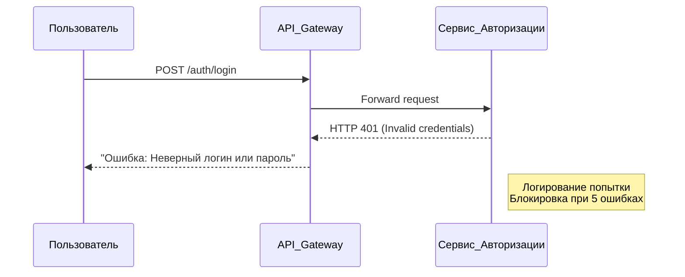
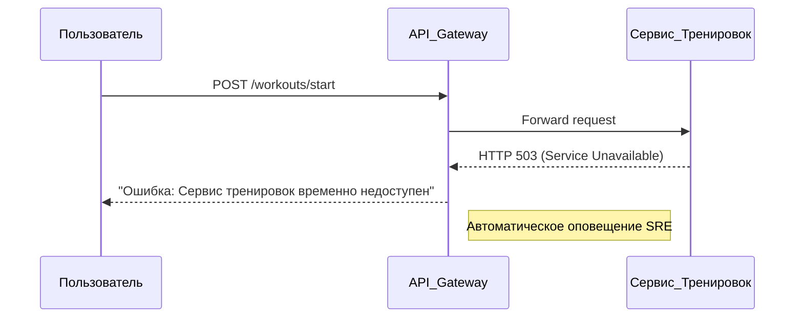
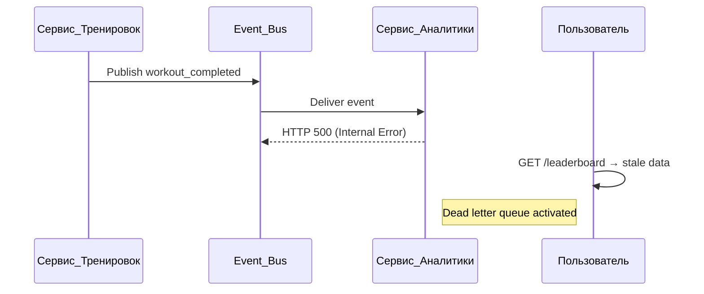
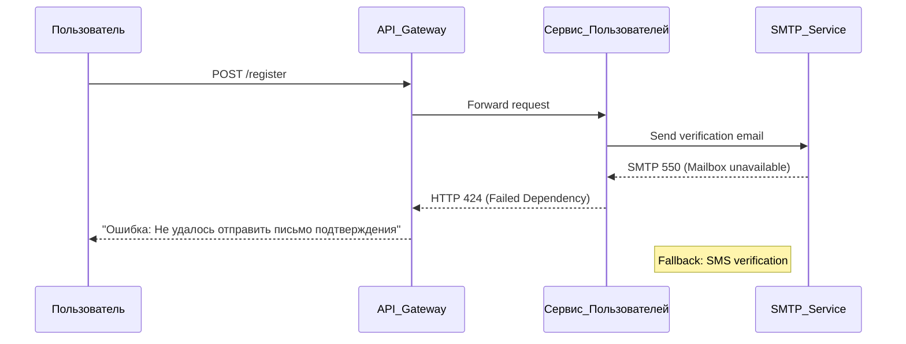
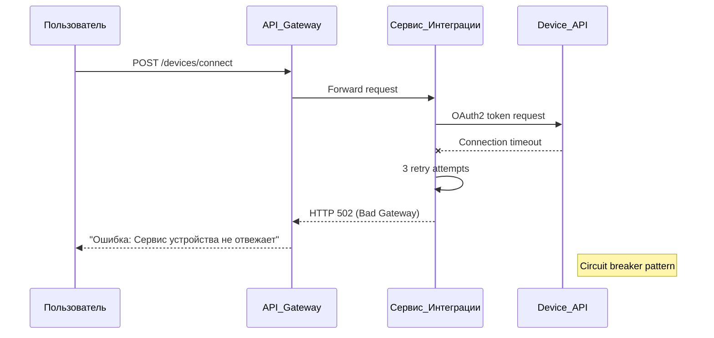
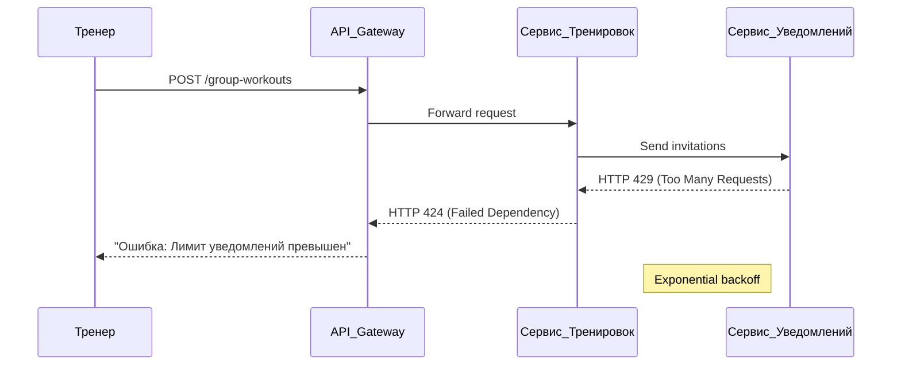
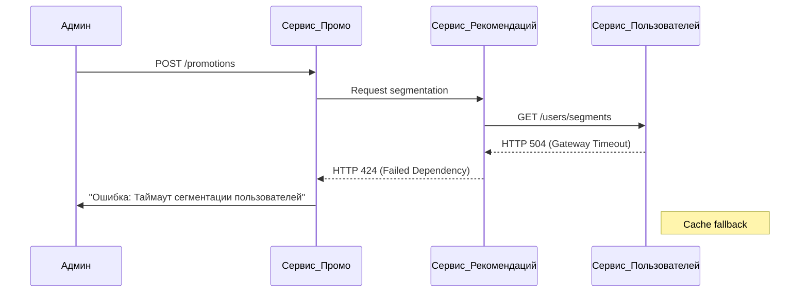
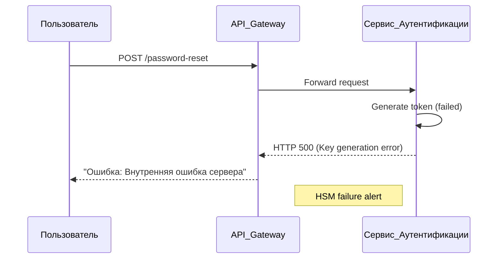

# Критические бизнес-сценарии

## 1. Пользователь не может войти в систему

## 2. Пользователь не может начать тренировку

## 3. Лидерборды не обновляются

## 4. Регистрация нового пользователя

## 5. Интеграция с фитнес-устройством 

## 6. Создание групповой тренировки

## 7. Обработка промоакций

## 8. Восстановление пароля
