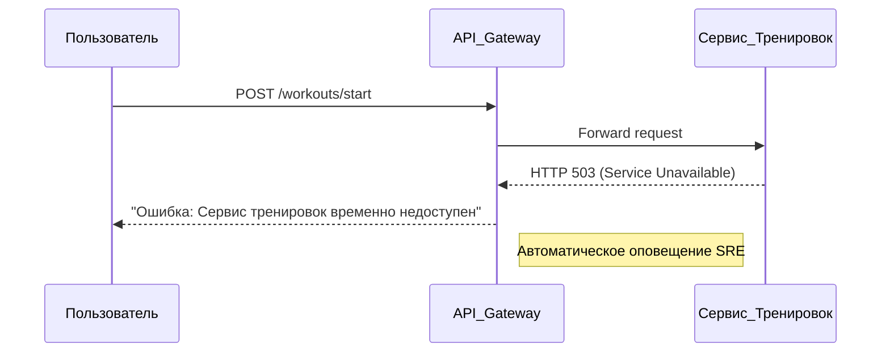

## Пользователь не может начать тренировку

```mermaid
sequenceDiagram
    participant Пользователь
    participant API_Gateway
    participant Сервис_Тренировок
    
    Пользователь->>API_Gateway: POST /workouts/start
    API_Gateway->>Сервис_Тренировок: Forward request
    Сервис_Тренировок-->>API_Gateway: HTTP 503 (Service Unavailable)
    API_Gateway-->>Пользователь: "Ошибка: Сервис тренировок временно недоступен"
    note left of Сервис_Тренировок: Автоматическое оповещение SRE
```