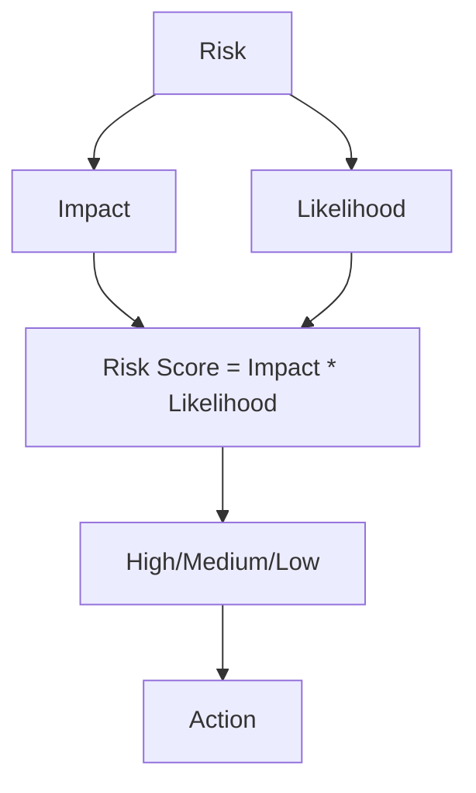

# Анализ рисков и компромиссов архитектуры

## Основные риски по слоям

### 1. **Инфраструктурный уровень**
| Риск | Описание | Снижение |
|------|----------|----------|
| Vendor lock-in | Использование managed-сервисов (MongoDB Atlas, AWS RDS) может привести к зависимости от провайдера | Использовать абстракции (DAO, repositories), избегать vendor-specific API |
| Несогласованность между ЦОДами | Асинхронная репликация между tertiary DC и primary может привести к потере данных при катастрофе | Ввести политики кворума (2/3 подтверждения) для критичных операций |

---

### 2. **Сервисный уровень**
| Риск | Описание | Снижение |
|------|----------|----------|
| Сложность управления микросервисами | Большое количество сервисов увеличивает сложность оркестрации и мониторинга | Использовать Kubernetes, Helm, Service Mesh (Istio или Linkerd) |
| Зависимость от Event Bus | При сбое Kafka могут быть потеряны события (например, `WorkoutCompleted`) | Добавить механизмы retry, dead-letter queues и backup event log |

---

### 3. **Базы данных**
| Риск | Описание | Снижение |
|------|----------|----------|
| Несоответствие ACID в документоориентированных БД | MongoDB не гарантирует транзакционности на уровне PostgreSQL | Использовать CQRS — запись через реляционную БД, чтение через документоориентированную |
| Проблемы с колоночными запросами | ClickHouse оптимален для агрегации, но плохо работает с точечными запросами | Кэшировать популярные запросы в Redis, использовать Materialized Views |

---

### 4. **AI/ML уровень**
| Риск | Описание | Снижение |
|------|----------|----------|
| Bias и Fairness моделей | Модели могут давать некорректные рекомендации, особенно медицинские | Проводить регулярный аудит моделей, использовать дифференциальную приватность |
| Cold start в Serverless | Lambda функции имеют задержку запуска, что влияет на инференс | Использовать provisioned concurrency, кэшировать часто используемые модели в Redis |

---

### 5. **Безопасность**
| Риск | Описание | Снижение |
|------|----------|----------|
| Утечка PII-данных | Хранение персональных данных в разных регионах повышает риск утечки | Шифрование данных, разделение ключей шифрования по регионам |
| Атаки на API Gateway | Возможны DDoS-атаки на External API Gateway | WAF, rate limiting, Cloudflare как барьер, защита через CDN |

---

## Компромиссы в архитектуре

| Область | Что выбрано | Альтернатива | Почему сделан компромисс | Чем жертвуем |
|--------|-------------|--------------|---------------------------|---------------|
| Архитектура | Гибрид: MSA + Serverless | Только MSA или только Serverless | Микросервисы дают контроль, Serverless — экономию | Сложность управления разнородной инфраструктурой |
| БД | Разные типы БД под разные задачи | Единая БД (например, PostgreSQL) | Производительность и масштабируемость важнее унификации | Увеличенная сложность работы с данными |
| AI/ML | PyTorch + XGBoost | TensorFlow Serving + SageMaker | Гибкость экспериментов важнее production-ready решений | Требуется больше усилий на deployment |
| События | Apache Kafka | RabbitMQ / AWS SNS | Нужна история событий и возможность replay | Высокая стоимость эксплуатации Kafka |
| Фронтенд | React Native | Swift/Kotlin | Быстрая разработка и общая команда | Зависимость от нативных модулей для GPS |
| Безопасность | Собственная аутентификация | Auth0 / Firebase Auth | Необходима кастомизация под бизнес-логику | Больше времени на поддержку и тестирование |
| Локализация данных | Global catalog + regional shards | Centralized storage | Соответствие GDPR/CCPA | Сложность маршрутизации запросов |
| CI/CD | GitLab CI + Terraform | AWS CodePipeline | Полный контроль над процессами | Требует настройки и поддержки |
| Кэширование | Redis Cluster | Memcached | Поддержка persistence и sharding | Стоимость лицензий, администрирование |
| Серверы | Multi-cloud стратегия | Single cloud | Защита от региональных сбоев | Сложность управления, возможный vendor lock-in |

---

## Методология оценки рисков (пример)

### Пример оценки риска: **Cold Start в Serverless**

| Критерий | Значение |
|---------|----------|
| Impact | High (задержки в реальном времени) |
| Likelihood | Medium (частые вызовы новых функций) |
| Risk Score | High |
| Action | Provisioned concurrency, использование Redis для кэширования моделей |

---

## Рекомендации по управлению рисками

| Категория | Рекомендации |
|----------|--------------|
| **Технические риски** | 
- Автоматическое тестирование сервисов  
- Использование Feature Toggles для безопасного релиза  
- Интеграционное тестирование между сервисами  
- Регулярные chaos-тесты (например, Chaos Monkey)  

| **Операционные риски** |
- CI/CD pipeline с rollback-возможностями  
- Регулярные бэкапы и проверки восстановления  
- Обучение команды работе с распределенной системой  

| **Юридические риски** |
- Ежеквартальный аудит соответствия GDPR/CCPA  
- Анонимизация данных при удалении аккаунта  
- Логирование всех изменений согласия пользователя  

| **Производственные риски** |
- Monitoring + alerting по SLI/SLO  
- Load testing перед пиковыми нагрузками  
- Использование circuit breaker pattern  

---

## Отслеживание рисков (пример таблицы)

| ID | Риск | Уровень | Статус | Ответственный | Срок | Примечание |
|----|------|---------|--------|----------------|------|------------|
| R001 | Cold Start в Serverless | High | In Progress | DevOps Engineer | 2025-Q2 | Используется provisioned concurrency |
| R002 | Vendor lock-in | Medium | Mitigated | Architect | — | Использование абстракций |
| R003 | Сложность микросервисов | High | Active | Tech Lead | — | Внедряется Service Mesh |
| R004 | Bias в AI-моделях | Medium | Planned | Data Scientist | 2025-Q3 | Проведение аудита |
| R005 | Утечка данных | Critical | Active | Security Lead | — | Шифрование + разделение ключей |
